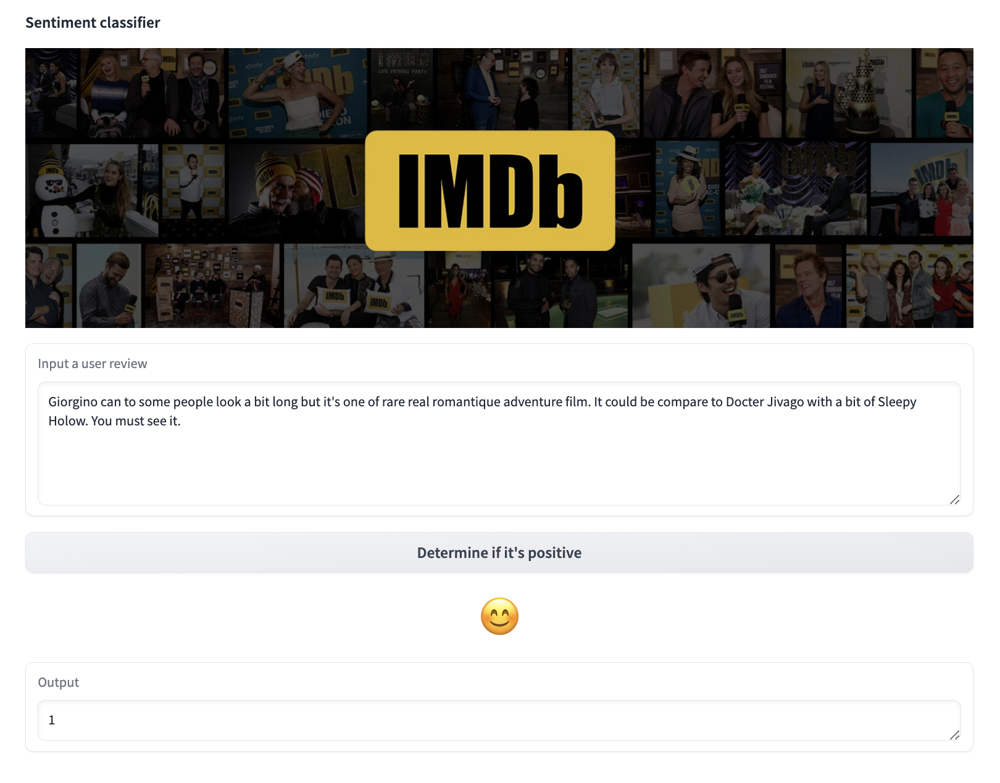

# A naive classifier for IMDb
As a demo to show how to finetune a NLP classification task with LoRA.

<br/>
The UI is shown below:

<p align="center">
  
</p>

<br/>
<br/>
<br/>
  
You can run the following script to start the Gradio web UI:
```bash
python3 main.py
```
  
<br/>
A brief description video is below:
<br/>
https://www.bilibili.com/video/BV1YVpte7EFL
<br/>
<br/>
The explanatory documentation is <a href="rs/LoRA-document.pdf">Here</a>。
<br/>

---

If you can't run it directly, you may need to do some preparation, including but not limilited to:

- Install libaray:
```bash
!pip install wordcloud seaborn transformers datasets peft
```

